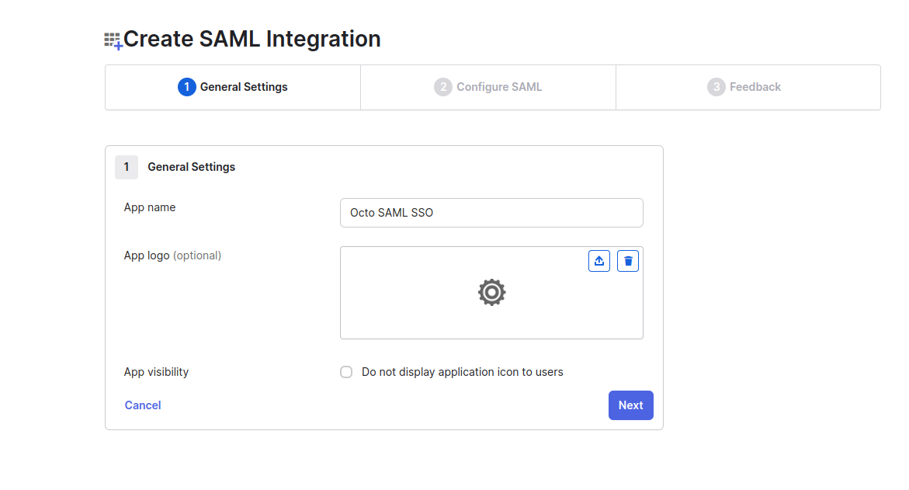
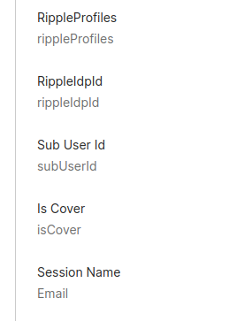
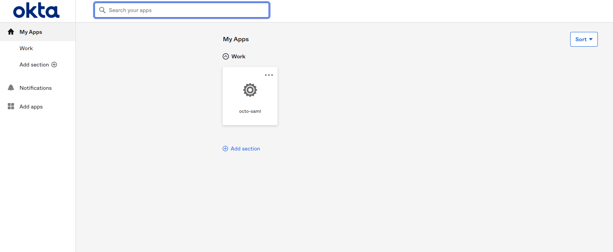
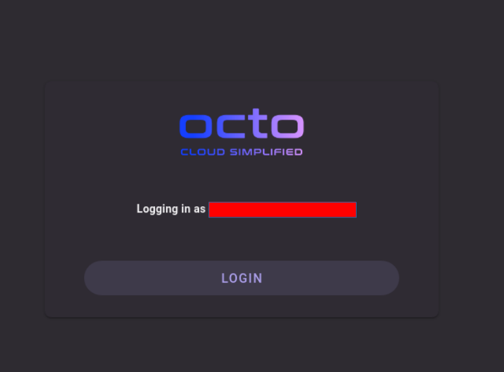
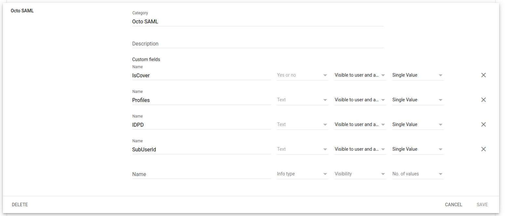
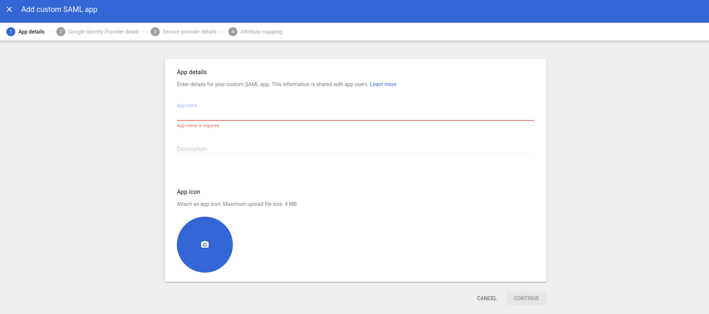

# SAML SSO

## Overview

Octo supports SAML SSO (Single-Sign-On) for user authentication. This allows users to login to Octo using their SAML IdP credentials.

Compared to the conventional password authentication access, this function enables centralized management for the admins and enhances security.

Curently Octo only supports the following SAML IdPs:

- Okta
- Google workspace

Pre-requisites:

- Sub User Id

(Admin only) To know what is your sub user id, go to [Octo](https://app.alphaus.cloud/octo) -> More -> Member -> click your account and in the right you should see the User ID.

- Org Id

## Okta SAML SSO

On your Okta Admin page:

1. Go to Application -> Create App Integration -> Choose SAML 2.0 -> Next

2. ### General Settings

   Name the app whatever you want, you can also put some of your custom logos, and then click next

3.  ### Configure SAML

    Single sign-on URL and Audience URI(SP Entity ID):

                    https://login.alphaus.cloud/octo/saml

    Enable the Use this Recipient URL, and Destination URL.

    #### Attibutes Statements

    Enter the following values:

    | **Name**                                                     | **Value**             |
    | ------------------------------------------------------------ | --------------------- |
    | `https://app.alphaus.cloud/octo/SAML/Attributes/IDPID`       | `user.rippleIdpd`     |
    | `https://app.alphaus.cloud/octo/SAML/Attributes/Profiles`    | `user.rippleProfiles` |
    | `https://app.alphaus.cloud/octo/SAML/Attributes/SessionName` | `user.Email`          |
    | `https://app.alphaus.cloud/octo/SAML/Attributes/IsCover`     | `user.isCover`        |
    | `https://app.alphaus.cloud/octo/SAML/Attributes/SubUserId`   | `user.subUserId`      |

    leave remaining values to default, then Click Next.

    #### Help Okta Support understand how you configured this application

    Click whatever it may apply and then Finish.

### Getting the metada.xml

On you created application, go to -> Sign-on, and open the link in the Metadata URL.

After opening, it should open another tab and right click anywhere and save as `metadata.xml`

### Registering the Idp to Octo

Go to [Octo](https://app.alphaus.cloud/octo), in the preferences found in the top right corner beside your profile avatar. Go to Identity Provider Management Tab and register your recently saved `metadata.xml` file. Take note of the IdpId you would need it in the next steps.

### Setup Attributes to Users

Go back to Okta admin page, under Directory -> Profile Editor, choose User(default) and add these Attributes:

### Assign Users to the Application

There are 2 steps to assign users to the application:

1. On Okta admin page, go to Directory -> People, and choose the user you want to assign to the application, and then go to Applications tab and assign the application you created.

2. On Okta admin page, go to Applications -> Applications, and choose the application you created, and then go to Assignments tab and assign the user you want to assign to the application.

By assigning users to the application, they will be able to see the application on their Okta dashboard.

### Update the user info

On Okta admin page, go to Directory -> People, and choose the user you want to update their info then go to Profile and edit

Update the values of these attributes:

RippleProfiles: `{orgId}:{roles}` it safe to assume this value for now -> `{orgId}:user/Viewer`

RippleIdpId: `{The IdpId of the metadata.xml you regsitered in octo}`

SubUserId: `{The id of the current user's octo account}`

IsCover: `true`

SessionName: `{email of the current user}`

### Check and verify login

On you Okta dashboard, you or anyone assigned to the app should see the application you just added

Open the app, and you should be able to see this dialog. You can log in if it is successful.

## Google Workspace SAML SSO

Note: You must be a super admin to add SAML apps to your Google Workspace account.

#### Creating Custom attributes

1.  Go to [Google Workspace Admin Console](https://admin.google.com/)

2.  Go to Directory -> Users -> More options -> Manage custom attributes -> ADD CUSTOM ATTRIBUTE

Add something like this:

#### Creating Custom Saml APP

1.  Go to [Google Workspace Admin Console](https://admin.google.com/)

2.  Go to Apps -> SAML Apps -> Web and mobile apps

3.  Click the plus button to add a new SAML app

4.  Click add my own custom app

#### App Details

You can name the app whatever you want, you can also put some of your custom icon, and then click continue

#### Google Identity Provider details

Click Download Metadata

#### Service provider details

After downloading the metadata, you would need to enter this:

ACS URL: `https://login.alphaus.cloud/octo/saml`

Entity ID: `https://login.alphaus.cloud/octo/saml`

Leave remaning settings to default, then click continue.

#### Attribute mapping

Click add mapping, then input these:

| **Google Directory attributes** | **App attributes**                                           |
| ------------------------------- | ------------------------------------------------------------ |
| `IsCover`                       | `https://app.alphaus.cloud/octo/SAML/Attributes/IsCover`     |
| `Profiles`                      | `https://app.alphaus.cloud/octo/SAML/Attributes/Profiles`    |
| `IDPID`                         | ` https://app.alphaus.cloud/octo/SAML/Attributes/IDPID`      |
| `SubUserId`                     | `https://app.alphaus.cloud/octo/SAML/Attributes/SubUserId`   |
| `Primary email`                 | `https://app.alphaus.cloud/octo/SAML/Attributes/SessionName` |

### Registering the Idp to Octo

Go to [Octo](https://app.alphaus.cloud/octo), in the preferences found in the top right corner beside your profile avatar. Go to Identity Provider Management Tab and register your recently saved `metadata.xml` file. Take note of the IdpId you would need it in the next steps.

#### Add values to custom attributes to users

1. Go to directory -> Users -> and choose the user you want to add the custom attributes
2. Go to the User information -> Octo Saml Attributes, edit and add the needed values

IsCover: `true`

Profiles: `{orgId}:{roles}` it safe to assume this value for now -> `{orgId}:user/Viewer`

IDPD: `{The IdpId of the metadata.xml you regsitered in octo}`

SubUserId: `{The id of the current users octo account}`

#### Check and verify login

Note: Make sure your app is set to On for everyone to make it visible to everyone. If not, go to the app you created and go to the User access tab and click to edit and set it to On for everyone.

On you Google Workspace dashboard, you or anyone assigned to the app should see the application you just added.

You can also test the app as an admin by clicking the Test SAML login button.

For users they can found the app in the Google Apps beside their profile.
